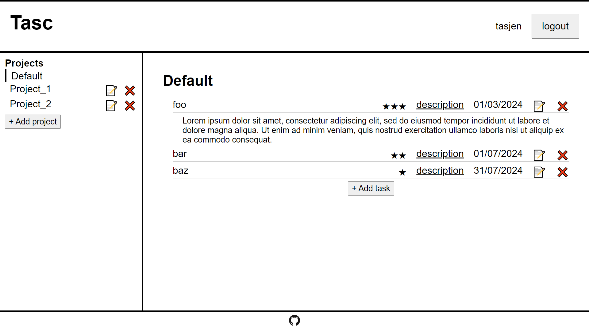
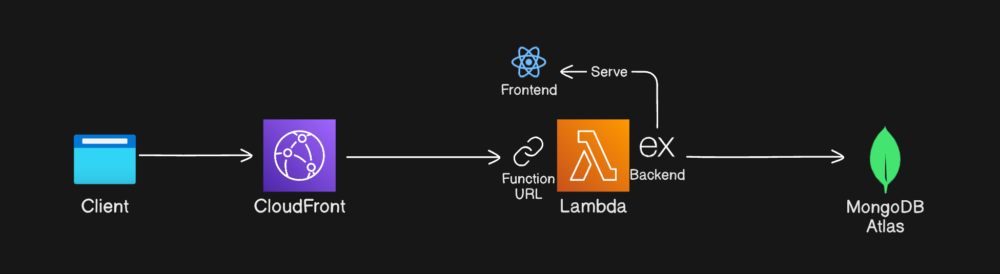
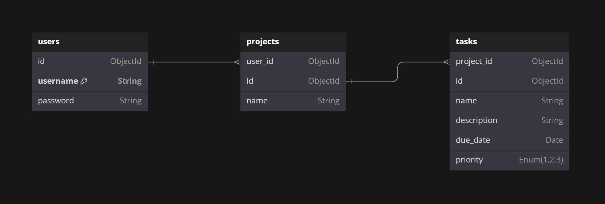
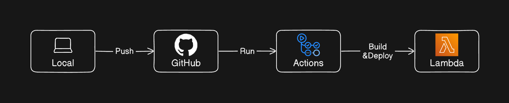

# Tasc

My first full stack project, **_[Tasc](https://tasc.tasjen.pro)_**, is a CRUD todo-list application. It is implemented using the MERN stack and TypeScript with a simple authentication feature. Styled in plain CSS.

## Features

- Clean UI with minimal style
- Username/password authentication
- Create/update/delete projects
- Create/update/delete tasks

## Tech & Tools

- [TypeScript](https://www.typescriptlang.org/) - JavaScript with types
- [Vite](https://vitejs.dev/) - A modern frontend tooling
- [React](https://react.dev/) - A component-based frontend JavaScript library
- [React Query](https://tanstack.com/query/latest) - A data caching library for React
- [React Router](https://reactrouter.com/en/main) - A library for client-side routing in React apps
- [Node.js](https://nodejs.org/) - A JS runtime for the backend
- [Express](https://expressjs.com/) - A backend framework for Node.js
- [pnpm](https://pnpm.io/) - A Node.js package manager, up to 2x faster than npm
- [esbuild](https://esbuild.github.io/) - An extremely fast JS and TS bundler
- [JWT](https://jwt.io/) - A modern secure method for authentication
- [Cypress](https://www.cypress.io/) - A testing library for Node.js
- [MongoDB](https://www.mongodb.com/) - A NoSQL database system
- [Mongoose](https://mongoosejs.com/) - A MongoDB ODM for Node.js
- [GitHub Actions](https://github.com/features/actions) - A CI/CD platform from GitHub
- [Terraform](https://www.terraform.io/) - A tool for provisioning cloud infrastructure

## Architecture

## Data model

## CI/CD

### Appendix

- All the diagrams shown above were drawn using **[eraser.io](https://www.eraser.io/)** and **[dbdiagram.io](https://dbdiagram.io/)**
